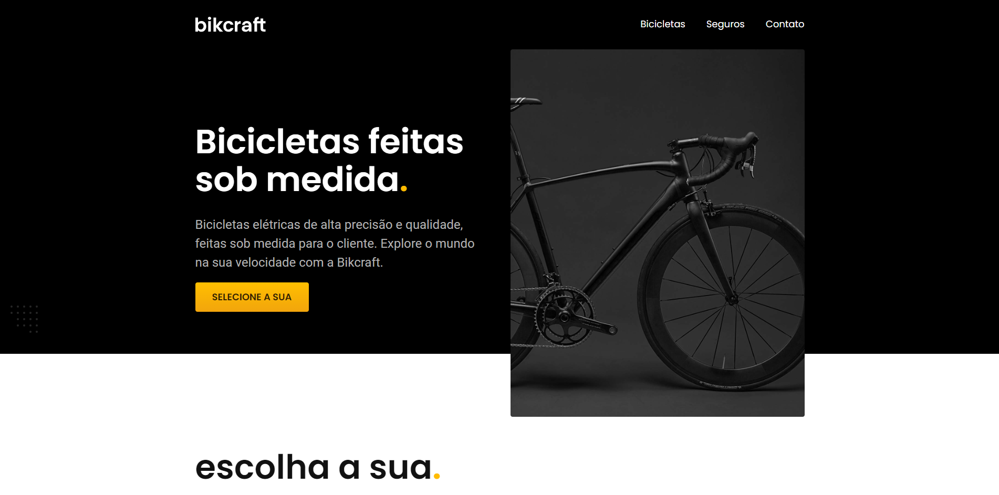

# Bikcraft
Bikcraft - Origamid

## Description
This is a project by [Origamid](https://www.origamid.com/) course. The project's main intention is study and realize a application near of a real life, using HTML, CSS and a little bit of JavaScript.

## Learned
- Beginner HTML and CSS;
- Positioning CSS;
- Semantic HTML;
- CSS Properties;
- Responsive;
- Beginner JavaScript.

## Technologies Used
- JavaScript;
- CSS;
- HTML.

## Screenshots

*Subtitle: Screenshot of the main screen. Logo and nav menu on the top of image, on the middle of image a big heading and paragraph, side that a image of black bike.*

 

 
*Subtitle: Screenshot of the main screen responsive (width: 800px). Logo and nav menu on the top of image, on the middle of image a big heading and paragraph, one below the other, below that a image of a black bike.*

## Links
- [Solution](https://viniciussnitram.github.io/bikcraft/)
- [LinkedIn](https://linkedin.com/in/viniciussmartins/)